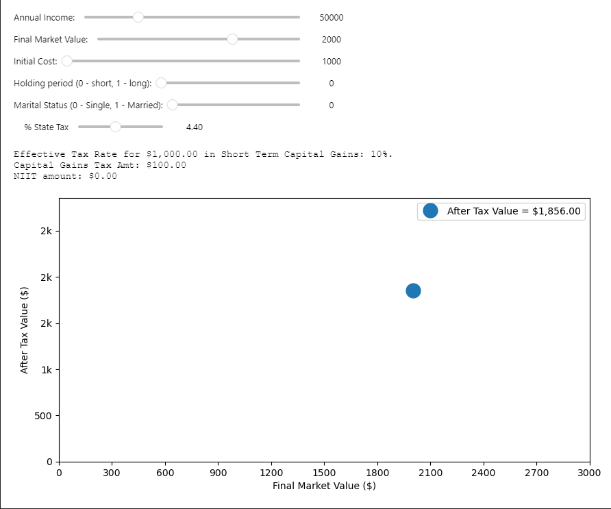
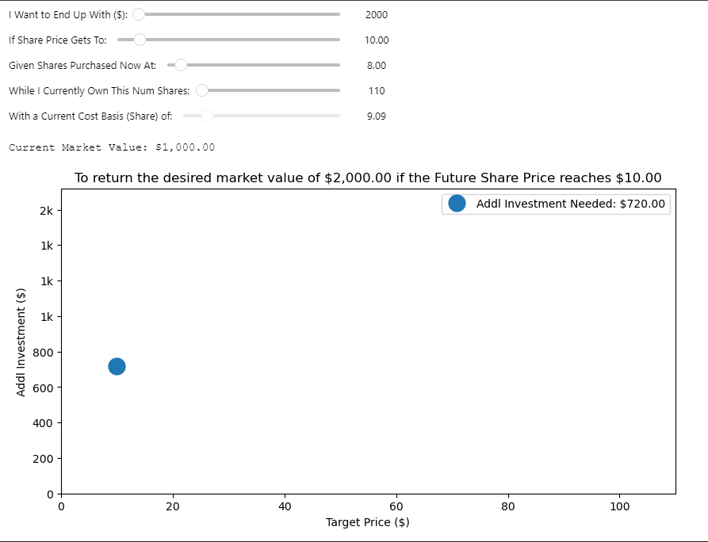

# Plotting Investment Scenarios with Pandas and Matplotlib

This is a playground project to experiment with using the Python libraries Pandas and Matplotlib by plotting and exploring different investment scenarios.

- Print Pandas DataFrame Tables for different Investing scenarios
- Calculate Capital Gains taxes for long term investments
- Plot future price targets and investment amounts given a desired return

### Prerequisites:

- Python 3.10+
- Jupyter Notebook

### Run the Notebook

- Start Jupyter Notebook
- Select a Python Environment (create a virtual env with a min. version of Python 3.10)
- Install requirements if needed from the requirements.txt (`pip install -r requirements.txt`)
- Most of the important parameters for the cells are at the top in the first cell

### Interactive plot for Capital Gains Tax calculations:

### Interactive Plot for Investment Scenarios

